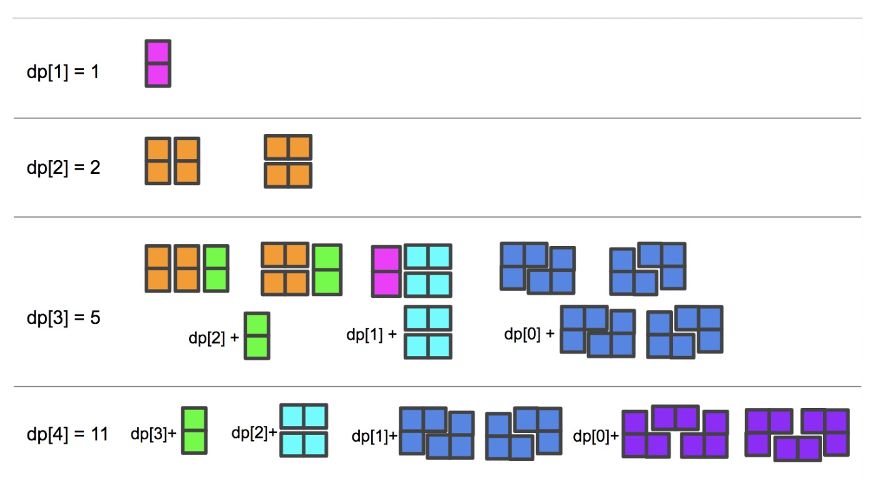

#### 我们有两种瓷砖：一种 2x1 多米诺形状，一种“L”型三格骨牌形状。这些形状可以被旋转。

```java
XX  <- 多米诺

XX  <- 三格骨牌
X
```

#### 给定`N`，有多少方法可以铺完一个2 x N的地板？返回答案模 `10^9 + 7` 之后的结果.

#### (在铺地板的过程中，一个方格必须被一块砖覆盖。两种铺法是不同的当且仅当在地板上存在两个上下或左右相邻的格子，只有一种铺法使得这两个格子被同一块瓷砖覆盖）


[domino-and-tromino-tiling](https://www.lintcode.com/problem/domino-and-tromino-tiling/description)


### **样例**

**样例 1:**

```java
输入: 3 
输出: 5
解释: 下列为5种方式, 不同的字母表示不同的瓷砖
  1. XYZ  2. XXZ  3. XYY  4. XXY  5. XYY
     XYZ     YYZ     XZZ     XYY     XXY
```

**样例 2:**

```java
输入: 1
输出: 1
```





**思路**

```java
根据上图我们可以总结一个很重要的规律，就是dp[n]是由之前的dp值组成的，其中 dp[n-1] 和 dp[n-2] 各自能贡献一种组成方式，而dp[n-3]，一直到dp[0]，都能各自贡献两种组成方式，所以状态转移方程呼之欲出：

dp[n] = dp[n-1] + dp[n-2] + 2 * (dp[n-3] + ... + dp[0])

        = dp[n-1] + dp[n-3] + dp[n-2] + dp[n-3] + 2 * (dp[n-4] + ... dp[0])

        = dp[n-1] + dp[n-3] + dp[n-1]

        = 2 * dp[n-1] + dp[n-3]
```


```java
public class Solution {
    private static final int MOD = (int) 1e9 + 7;

    /**
     * @param N: a integer
     * @return: return a integer
     */
    public int numTilings(int n) {
        // write your code here
        if (n <= 0) {
            return 0;
        }

        if (n == 1) {
            return 1;
        }
        if (n == 2) {
            return 2;
        }
        long[] dp = new long[n + 1];
        dp[0] = 1;
        dp[1] = 1;
        dp[2] = 2;
        for (int i = 3; i <= n; i++) {
            dp[i] = (2 * dp[i - 1] + dp[i - 3]) % MOD;
        }
        return (int) dp[n];
    }
}
```


